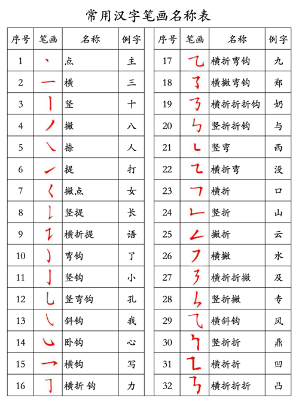

# 直书—基于华为HMS Core ML Kit的人工智能趣学汉字小程序

> 2019-12-15
>
> 2022-5-11

## 直书—即查即用的AI学汉字小程序

“直书”—基于华为HMS Core ML Kit的人工智能趣学汉字小程序。

搭载拍照识别、语音识别、AI翻译、语音生成等人工智能黑科技，外国人也可轻松上手，即查即用，一站式掌握汉字音、形、写、义。

“直书”提供各国语言的微信小程序、华为快应用、网页、手机APP、平板APP。

讲好中国故事，提升文化自信，助力全球二十亿汉语学习者。

项目主页：https://github.com/TommyZihao/EasyHanzi

## 支持平台

| 平台              | 适用场景                   | 常见地区                 |
| ----------------- | -------------------------- | ------------------------ |
| 微信小程序        | 有微信有网络就能用         | 全球                     |
| 华为快应用        | 华为手机                   | 全球                     |
| QQ小程序          | 有QQ有网络就能用           | 中国大陆                 |
| 网页              | 有网就能用                 | 全球孔子学院、汉语文化圈 |
| 安卓APP、IOS端APP | 智能手机或平板             | 全球汉语学习者           |
| 平板APP           | 触摸交互沉浸式智能笔画校对 | 中小学、图书馆、博物馆   |

不需安装，扫码即开，打开即用，用完即走，跨平台兼容，充分体现互联网产品轻量化、智能化、云计算的用户交互特点。

支持常见九千个简体、繁体字。

## 用户群体：二十亿汉语文化圈

- 中国大陆中小学校
- 图书馆、博物馆等科普机构
- 书法与国学爱好者
- 港澳台地区学习繁体字、推广简体字
- 在华留学生
- “一带一路”沿线汉语学习者
- 全球孔子学院
- 全球汉语文化圈

## 功能说明

- 笔顺动画演示

- 交互式摹写与临写。

- 简繁体转换
- AI智能拍照识字：方便不会使用汉语拼音和输入法的朋友。基于华为ML Kit OCR文字识别API。
- 机器翻译：输入英文，生成对应汉语。基于华为ML Kit 机器翻译API。
- 文本转语音：输入汉字文本，生成朗读语音。基于华为ML Kit语音合成接口。
- 语音识别：开启麦克风输入语音，识别对应的汉语。基于华为ML Kit语音识别接口。

## 愿景：讲好中国故事，树立文化自信

> 坚定中国特色社会主义道路自信、理论自信、制度自信，说到底是要坚定文化自信。文化自信是更基本、更深沉、更持久的力量。 
>
> ——总书记在全国宣传思想工作会议重要讲话。 

随着中国改革开放的迅速崛起，来华留学生数量逐年增加，各类汉语诗词国学综艺节目广受好评，海外孔子学院全球推广，全球汉语教育呈现火热趋势。

世界上使用汉语的人数至少15亿  ，超过世界人口的五分之一。汉语是中国官方语言，也是新加坡、联合国工作语言之一。

 2016年时，英当局耗资近8700万人民币投入到了在公立学校推进汉语教学的计划中。 

早在十年前，日本就有630家大学开设了中文课程，而汉语学习的人数则超200万人，学习汉语已经成为日本学生必备的一项课程。汉语也是日本除了英语外的第二大外语。 

汉语也是全世界公认最难学的语言之一。

俗话说：“人生聪明写字始”。掌握好笔顺是写字的基本功，也是学习汉语的第一关。

然而，汉字数量繁杂、笔画各异，不易记忆，难倒了众多汉语初学者。很多学习汉语多年的在华留学生，虽然说着流利的汉语，却提笔难言。

甚至有些土生土长的中国人，写字的笔顺也是错误的。

例如：

“匕”应该先写撇，后写竖弯钩。 

“火”应该先写上面两笔，即点和撇，再写人字。 

港澳台同胞不写简体字，然而我们同样也不会写繁体字，十九大报告指出，实现祖国完全统一。简繁体汉字在无形中形成一道文化的隔膜，阻碍了文化认同和文化自信。
所以，我们为小程序增加了简繁体两个界面。

既方便港澳台同胞学习简体字，也方便内地的书法爱好者，国学爱好者学习繁体字，繁体字其实有更复杂的笔画，查字典是效率最低的方式，我们的小程序就是不二之选。

## 开发团队：在华留学生+全栈工程师

产品经理：同济子豪兄

前端开发、UI设计、全栈开发：Maxoyed 

用户交互优化、法语界面：Itoua Prince Igor（刚果布留学生） 

PPT设计：向凤麟、郑雨涵

## 参考资料

- 华为 ML Kit开发者文档：https://developer.huawei.com/consumer/cn/hms/huawei-locationkit

- Javascript 开源库  Hanzi Writer  

文档： https://chanind.github.io/hanzi-writer/cn/docs.html 

Github开源地址：https://github.com/chanind/hanzi-writer 

作者： https://github.com/chanind 

汉字数据来自 [Make Me a Hanzi](https://github.com/skishore/makemeahanzi) 项目, 提供 9000 +常用简体字和繁体字。 

Hanzi Writer 库仅仅 30 kb （压缩后仅 9kb!）, 所以添加它不会使网页体积增大。 

Hanzi Writer 使用Javascript, HTML5 and SVG, 所以它能嵌入到任何平台，包括 iOS 、安卓、桌面端应用和网页、微信小程序。 
